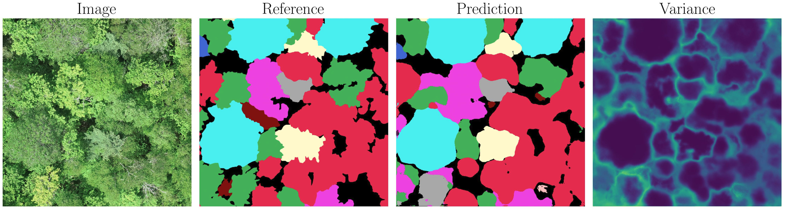

# 🌳 TreeAI Segmentation

A deep learning pipeline for **pixel-wise tree segmentation** from aerial imagery enabling both species classification and crown delineation.
This repository was created as part of the **UZH Master's course AI4Good**.

## ✨ Motivation
Tree species segmentation plays a crucial role in **biodiversity monitoring**, **forest management**, and **climate change research**.  
Accurate mapping of tree species enables better decision-making for conservation efforts and sustainable forestry.

## 📊 Dataset
We use the **TreeAI dataset**, a **global collection of tree species annotations and high-resolution imagery**.  

- Contains **high-resolution samples across diverse ecosystems**.  
- Published on **Zenodo**: [TreeAI dataset](https://zenodo.org/records/15351054)
- Further details:  
  - [EGU 2025 abstract](https://meetingorganizer.copernicus.org/EGU25/EGU25-18117.html)  
  - [SmartForest 2025 abstract](https://smartforest.ai/wp-content/uploads/2025/02/SmartForest-2025-Abstract-TreeAI-a-global-database-for-tree-species-annotations-and-high-resolution-imagery.pdf)

The default storage location originating from this repo is `../data/TreeAI/`. See under Project Structure for more information. A test set of the data for the AI4Good course is located on the iMath server.

## ⚙️ Environment Setup
Clone this repo. Install [miniconda](https://www.anaconda.com/docs/getting-started/miniconda/install#linux-2). Create a new conda environment **treeAI** and install the following dependencies. **Weights & Biases** (account needed) is the default for logging, but other tools work similarly.

```bash
conda create -n treeAI python=3.12
conda activate treeAI

```
Then install the needed requirements (see requirements.txt).

## 🚀 Training & Testing
This repository uses Hydra for flexible experiment configuration. So model training can be just started with `train.py`. 

Corresponding configuration files are in `configs/train.yaml` with second level configs listed in the header of this file. Those second-level configs are grouped:

- **data**: `configs/data/treeAI.yaml`
- **model**: `configs/data/model_treeAI.yaml`

These files serve as the default configurations. The same structure applies for `test.py`, where at least the experiment name on which the evaluation is to take place must be specified in `test.yaml` or the command line.

Most parameters can be overwritten from the command line. If multiple data or model parameters need to be changed simultaneously, it is often convenient to create a custom YAML file following the same structure as the default files. They can then be overwritten again in the command line.
```
python train.py data=data_treeAI_vernon model=model_UNet_resnet18
```

## 📂 Project Structure
```
treeAI-segmentation/
│── train.py                  # training script
│── test.py                   # testing / evaluation
|── a_preprocessing_data/     # used to create new folder and relabling data
|── analyse_data/             # to show specie distributions
|── analyse_results/          # plot and analyse results 
│── configs/                  # hydra configuration files
│── models/                   # model definitions
│── datasets/                 # dataset loading & preprocessing
|── distancematrix/           # create and store the distance matrix
|── losses_and_metrixs/       # define additional lossfunctions and metrics
│── utils/                    # helper functions
data/
│── TreeAI
│ ├── 12_RGB_SemSegm_640_fl
│ │ ├── train                 # training data 
│ │ │ ├── images
│ │ │ ├── labels
│ │ ├── val                   # validation data 
│ │ │ ├── images
│ │ │ ├── labels
│ │ ├── test                  # test data 
│ │ │ ├── images
│ │ │ ├── labels
│ │ ├── pick                  # selected data for visualization
│ │ │ ├── images
│ │ │ ├── labels
│ ├── 34_RGB_SemSegm_640_pL
│ │ ├── ...
| |─ 12_RGB_ObjDet_both      # data which is in both 12 ObjDet and 12 SemSegm datasets
| | ── ...
...
```
For more information about the dataset folders check the README.txt files in the corresponding folder.


